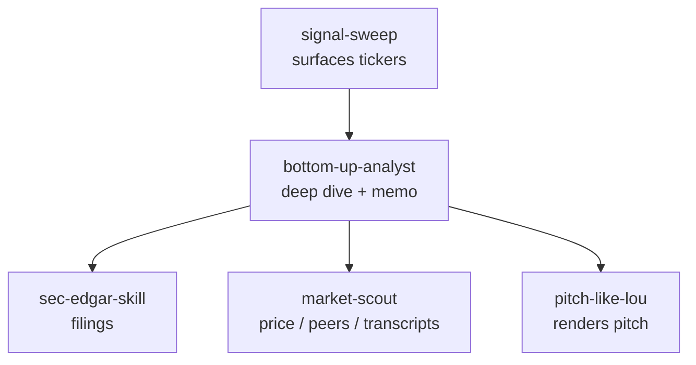

# MAP.md

Where things live and how data flows. Read before touching structure or data flow.

## Repo shape

A monorepo of five self-contained agent skills. Each skill is a folder with its
own `SKILL.md` (agent entry point), optional `references/` (progressive-disclosure
guides), `scripts/` (Python helpers), and `requirements.txt`.

```text
signal-sweep/        Discovery — scan the universe, surface tickers
sec-edgar-skill/     Data — SEC EDGAR filings, ownership, 13F holders
market-scout/        Data — price, peers, transcripts (Yahoo Finance)
bottom-up-analyst/   Analysis — one ticker → auditable memo (the conductor)
pitch-like-lou/      Voice — finished thesis → VIC-style pitch
```

Root config: `pyproject.toml` (ruff + package metadata), `uv.lock`,
`.markdownlint-cli2.jsonc` / `.markdownlint.json`, `.github/workflows/`.

## Skill internals

- `signal-sweep/` — `scripts/scan_insiders.py`, `scan_market.py`,
  `scan_conferences.py`, `search_themes.py`; universe config in `screens.json`;
  shared bootstrap in `scripts/_common.py`.
- `sec-edgar-skill/` — `scripts/fetch_*.py`, `parse_financials.py`, `orient.py`,
  `list_headings.py`; guides in `references/`; shared bootstrap in `scripts/_common.py`.
- `market-scout/` — `scripts/fetch_market_data.py`, `fetch_transcripts.py`,
  shared `scripts/_common.py`.
- `bottom-up-analyst/` — valuation `scripts/dcf.py`, `epv.py`; archetypes and
  guides in `references/`.
- `pitch-like-lou/` — reference corpus only, no scripts.

## Data flow



- `bottom-up-analyst` is the brain and conductor: it decides what to pull,
  reasons over it, and writes the memo. The data skills never decide what matters.
- The two data skills (`sec-edgar-skill`, `market-scout`) know nothing of each
  other and are swappable.
- `signal-sweep` and `sec-edgar-skill` both read `EDGAR_IDENTITY` and share an
  on-disk cache contract defined in `_common.py`.

## Production order

`signal-sweep` → `bottom-up-analyst` → memo → (optionally) `pitch-like-lou`.
