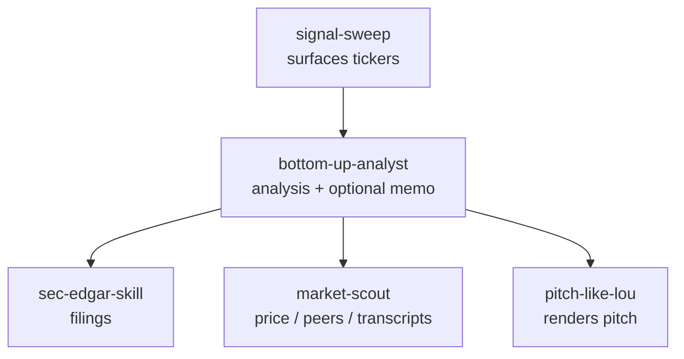

# MAP.md

Where things live and how data flows. Read before touching structure or data flow.

## Repository shape

A Git Pi package containing five self-contained agent skills. The skills live under
`skills/` so the root of the repository can focus on package/profile setup.

```text
package.json          Pi package manifest for the tool-envelope extension and five skills
SYSTEM.md             Research-agent identity installed into the isolated profile
extensions/           Restores Pi's tool prompt envelope and brands the startup header
scripts/bootstrap.mjs Isolated-profile bootstrap
skills/               Skill collection and skill-level documentation
  signal-sweep/       Discovery — scan the universe, surface tickers
  sec-edgar-skill/    Data — SEC EDGAR filings, ownership, 13F holders
  market-scout/       Data — price, peers, transcripts (Yahoo Finance)
  bottom-up-analyst/  Analysis — one operating company → scoped answer or memo
  pitch-like-lou/     Voice — finished thesis → VIC-style pitch
context/              Agent-maintained project documentation
```

The package manifest exposes the five individual directories under `skills/`. It does not
expose `skills/README.md` as a skill.

## Pi profile data flow

The bootstrap configures the isolated profile at `~/.pi/secstack-agent`. Its
`settings.json` owns separate top-level package entries for:

- this SecStack package;
- the filtered `pi-setup` package;
- `pi-system-prompt-viewer`;
- `pi-freeflow`; and
- `agent-browser`.

Pi installs and updates each source independently. The bootstrap manages only those package
entries, the profile's Pi-managed shell path, the `quietStartup` preference, the profile-local
Python environment, and a relative `SYSTEM.md` symlink into the installed SecStack package. The
system-prompt-viewer package is the sole owner of the `/system-context` overlay. SecStack's
`restore-tool-envelope` extension restores Pi's live tool snippets and guidelines after
`SYSTEM.md` replaces Pi's coding-agent identity. Its `startup-header` extension replaces
Pi's built-in header with a responsive, theme-adaptive SecStack research mark and interactive
research pipeline. Coding-task guidance files are not linked, and the filtered `pi-setup` package
contributes no skills, including `repo-nav` and `bootstrap-docs`. Research runs in the primary
Pi context; no sub-agent package is installed. Authentication, model selection, provider
configuration, sessions, and unrelated settings remain profile-local and untouched.

## Skill internals

- `skills/signal-sweep/` — `scripts/scan_insiders.py`, `scan_market.py`,
  `scan_conferences.py`, `search_themes.py`; universe config in `screens.json`; shared
  bootstrap in `scripts/_common.py`.
- `skills/sec-edgar-skill/` — `scripts/fetch_*.py`, `parse_financials.py`, `orient.py`,
  `list_headings.py`; filing, financial, ownership, proxy/governance, and holdings guides in
  `references/`; shared bootstrap in `scripts/_common.py`.
- `skills/market-scout/` — `scripts/fetch_market_data.py`, `fetch_transcripts.py`, and shared
  `scripts/_common.py`.
- `skills/bottom-up-analyst/` — valuation `scripts/dcf.py`, `epv.py`; archetypes and guides in
  `references/`.
- `skills/pitch-like-lou/` — reference corpus only, no scripts.

## Data flow


```mermaid
flowchart TD
    SS[signal-sweep<br/>surfaces tickers] --> BUA[bottom-up-analyst<br/>analysis + optional memo]
    BUA --> SEC[sec-edgar-skill<br/>filings]
    BUA --> MS[market-scout<br/>price / peers / transcripts]
    BUA --> PLL[pitch-like-lou<br/>renders pitch]
```

- `bottom-up-analyst` selects evidence, reasons over it, and produces the requested analysis or
  full memo. Retrieval contracts and source semantics remain in the data skills.
- The two filing/market data skills know nothing of each other and are swappable.
- `signal-sweep` and SEC-facing `sec-edgar-skill` commands read `EDGAR_IDENTITY` and use
  on-disk cache contracts defined in their `_common.py` modules. The SEC skill's routine 13F
  convenience queries use 13f.info and expose underlying SEC periods and identifiers; raw
  EDGAR remains the deep-field and verification route.

## Production order

For a full thesis: `signal-sweep` → `bottom-up-analyst` → memo → optionally
`pitch-like-lou`.

For the package installation and isolated-profile workflow, start at the root
[`README.md`](../README.md). For the collection overview, start at
[`skills/README.md`](../skills/README.md).
