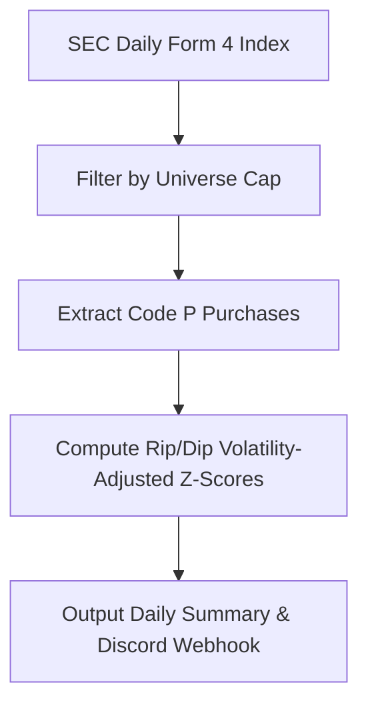
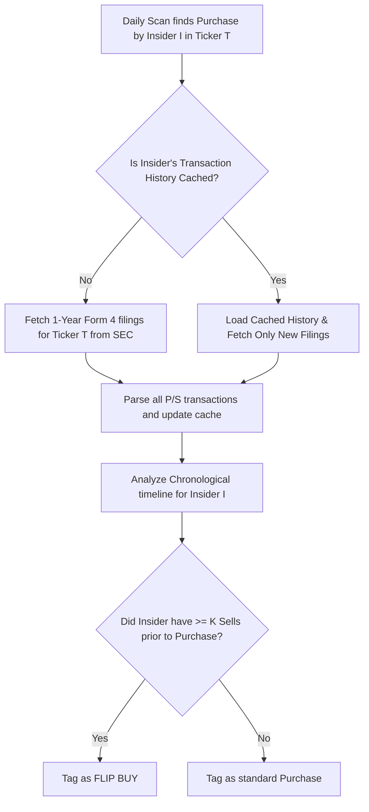

# Technical Analysis: Implementing a Flip-Buy Insider Filter

This document provides a comprehensive feasibility and difficulty analysis for implementing a **Flip-Buy** filter within the `signal-sweep` workspace. A flip-buy is defined as an open-market purchase (code `P`) by an corporate insider who has a history of recent open-market sales (code `S`).

---

## 1. Investment Thesis of the "Flip-Buy" Signal
In insider-activity analysis:
- **Routine Selling:** Insiders sell shares frequently for liquidity, tax management, or portfolio diversification. Sells are often automated under 10b5-1 plans and carry less directional information.
- **Active Buying:** Open-market purchases require active capital deployment and are strong indicators of valuation confidence.
- **The "Flip" Shift:** When an insider who has been consistently selling for months suddenly turns around and buys, it signifies a major sentiment inflection point. It indicates that the stock has reached a price point so low, or the business has reached a turning point so positive, that the insider is willing to break their selling pattern and deploy cash.

---

## 2. Current Architecture vs. Flip-Buy Requirements

### Current Flow in [scan_insiders.py](file:///D:/Misc2/06_backups/us-market-research-skills/signal-sweep/scripts/scan_insiders.py)
1. Fetches the daily bulk Form 4 index for the lookback window (e.g., last 5 trading days).
2. Filters to the market-cap universe ($50M–$10B) via `_common.in_universe`.
3. Parses open-market purchases (code `P`) from the current filings using `edgartools`.
4. Tags purchases with **Dip** or **Rip** labels using yfinance volatility metrics.
5. Emits the daily summary.



### Proposed Flip-Buy Flow
To detect a flip-buy, the system must inspect the *historical context* of the purchasing insider:



---

## 3. Core Implementation Challenges & Difficulty Level

We rate the overall implementation difficulty as **Moderate**. The mathematical logic is simple, but building a performant, SEC-compliant caching layer is crucial.

### Challenge A: SEC Rate Limiting & Network Overhead (High Complexity)
- **Problem:** If the daily scan finds purchases in 30 different tickers, fetching 12 months of Form 4 filings for each ticker at runtime requires making dozens of SEC EDGAR API calls. Under the SEC's fair access policy, requests are limited to **10 requests/sec**, and synchronous retrieval would make the daily scan take several minutes.
- **Solution:** A persistent transaction cache on disk (e.g. `signal-sweep-cache/insiders/{ticker}_txns.json`) is mandatory. For any ticker, the script should load the cache, find the latest cached transaction date, fetch only newer filings, and merge them.
- **Difficulty:** **Medium-High** (requires state management and robust exception handling).

### Challenge B: Insider Name Normalization (Medium Complexity)
- **Problem:** Insiders are represented by strings in the filing object (`row.get("Insider")`). Names may vary slightly across filings (e.g. "Smith John", "Smith John A.", "Smith John Jr.").
- **Solution:** Normalization helper to strip punctuation, remove middle initials/suffixes, and standardize formatting. Alternatively, extract the unique reporter CIK (`rptOwnerCik` XML node) from the raw Form 4 XML structure using `edgartools` if exposed.
- **Difficulty:** **Medium**.

### Challenge C: Defining a "Flip" Algorithmic Rule (Low Complexity)
- **Problem:** We need a clear mathematical definition of a flip to avoid tagging noise (e.g. an insider who sold $100 of shares for taxes but bought $100,000 of shares is a buy, not a flip).
- **Solution:** Define a parameterized rule:
  - **Lookback Period:** 180 to 365 calendar days.
  - **Sells Threshold:** Minimum of 2 or 3 distinct open-market sale transactions (code `S`).
  - **Consecutive Check:** No intervening purchases (code `P`) between the historical sells and the current purchase.
- **Difficulty:** **Low**.

---

## 4. Implementation Plan & Estimated Sizing

| Task | Description | Estimated Effort |
| :--- | :--- | :--- |
| **1. Caching Infrastructure** | Create state-management helpers in `_common.py` to save, load, and incrementally update `signal-sweep-cache/insiders/{ticker}_txns.json` using transaction lists. | 3–4 hours |
| **2. Historical Fetcher** | Add a fetcher in `scan_insiders.py` utilizing the cache to retrieve a ticker's 1-year transaction timeline (P and S) and update it incrementally. | 2–3 hours |
| **3. Detection Logic** | Implement name-normalization and the sequential logic check (e.g. checking if the prior transactions for that insider were consecutive sells). | 2 hours |
| **4. Reporting Integration** | Update formatting functions (`_signal_badge`, markdown table generation) and Discord webhook embeds to label and highlight `FLIP BUY` signals. | 2 hours |
| **5. Testing & Validation** | Run backfills against known historic flips (e.g., REFI) to ensure accuracy and measure speed/network usage. | 2 hours |
| **Total Sizing** | **11–13 developer hours (approx. 1.5–2 days of work)** | Moderate |

---

## 5. Draft Implementation Code Structure

To illustrate the technical execution, here is how the cache and checking logic could be implemented in Python:

```python
# In scripts/scan_insiders.py

import json
from pathlib import Path
from datetime import datetime, timedelta

def load_ticker_history(ticker: str, cache_dir: Path) -> list[dict]:
    """Load cached insider transactions for a ticker."""
    cache_path = cache_dir / "insiders" / f"{ticker}_txns.json"
    if cache_path.exists():
        try:
            return json.loads(cache_path.read_text(encoding="utf-8"))
        except Exception:
            return []
    return []

def save_ticker_history(ticker: str, txns: list[dict], cache_dir: Path) -> None:
    """Save ticker history to disk."""
    cache_path = cache_dir / "insiders" / f"{ticker}_txns.json"
    cache_path.parent.mkdir(parents=True, exist_ok=True)
    cache_path.write_text(json.dumps(txns, indent=2), encoding="utf-8")

def update_ticker_history(ticker: str, cache_dir: Path) -> list[dict]:
    """Incremental fetch of all Form 4 transactions (P and S) over 1 year."""
    from edgar import Company
    
    txns = load_ticker_history(ticker, cache_dir)
    last_date = max([t["date"] for t in txns]) if txns else None
    
    # Define start date (1 year lookback)
    start_dt = datetime.now() - timedelta(days=365)
    start_str = start_dt.strftime("%Y-%m-%d")
    
    # If we have cached transactions, start from the latest cached date to prevent re-fetching
    if last_date and last_date > start_str:
        fetch_start = last_date
    else:
        fetch_start = start_str
        
    date_range = f"{fetch_start}:{datetime.now().strftime('%Y-%m-%d')}"
    
    company = Company(ticker)
    filings = company.get_filings(form="4", date=date_range)
    
    new_txns = []
    if filings:
        for filing in filings:
            try:
                obj = filing.obj()
                df = obj.to_dataframe()
                if df is not None and not df.empty:
                    for _, row in df.iterrows():
                        code = row.get("Code", "")
                        if code in ("P", "S"):
                            new_txns.append({
                                "date": filing.filing_date,
                                "insider": row.get("Insider") or obj.insider_name,
                                "role": row.get("Position") or getattr(obj, "position", "Unknown"),
                                "code": code,
                                "shares": row.get("Shares", 0),
                                "price": row.get("Price", 0),
                                "remaining": row.get("Remaining Shares")
                            })
            except Exception:
                continue
                
    # Merge and deduplicate
    seen = set()
    merged = []
    for t in txns + new_txns:
        # Deduplicate using uniquely identifying fields
        key = (t["date"], t["insider"], t["code"], t["shares"], t["price"])
        if key not in seen:
            seen.add(key)
            merged.append(t)
            
    merged.sort(key=lambda x: x["date"])
    save_ticker_history(ticker, merged, cache_dir)
    return merged

def check_flip_buy(ticker: str, purchase_insider: str, purchase_date: str, txns: list[dict], min_sells: int = 2) -> bool:
    """Check if the purchase was preceded by a series of sells by this insider."""
    # Normalize name for comparison
    def norm(name):
        return "".join(name.upper().split())
        
    insider_norm = norm(purchase_insider)
    
    # Filter and sort prior transactions
    prior_txns = []
    for t in txns:
        if t["date"] < purchase_date and norm(t["insider"]) == insider_norm:
            prior_txns.append(t)
            
    prior_txns.sort(key=lambda x: x["date"], reverse=True) # newest first
    
    sells_count = 0
    for t in prior_txns:
        if t["code"] == "S":
            sells_count += 1
        elif t["code"] == "P":
            # An intermediate purchase breaks the "flip" sequence
            break
            
    return sells_count >= min_sells
```

---

## 6. Recommendations & Trade-offs
1. **Name Matching Stability:** While string normalization is usually sufficient, we recommend looking into `edgartools`' API to see if the reporting owner's CIK is exposed directly. Using CIKs guarantees zero name-collision bugs.
2. **Programmatic (10b5-1) Sells:** Programmatic sells are scheduled and less discretionary. Consider filtering out sales that are flagged as 10b5-1 (this is represented by a footnote in Form 4s). If the sales were purely 10b5-1, the "flip" is slightly less significant than if they were active, discretionary sells. However, discretionary sells followed by a buy represents a maximum-conviction pivot.
3. **Execution Mode:** To avoid slowing down the default scan, we suggest adding a `--detect-flips` CLI flag to `scan_insiders.py` so that users can opt-in to this intensive analysis step when needed.
